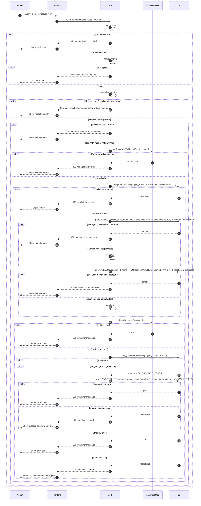

# Admin Panel Sequence Diagram: createEmployee

```mermaid
sequenceDiagram
autonumber
participant Admin
participant Frontend
participant API
participant PasswordUtils
participant DB

Admin->>Frontend: Submit create employee form
Frontend->>API: POST /api/admin/employees (payload)
API->>API: requireAuth
alt Not authenticated
API-->>Frontend: 401 authentication required
Frontend-->>Admin: Show auth error
else Authenticated
API->>API: requireAdmin
alt Not admin
API-->>Frontend: 403 admin access required
Frontend-->>Admin: Show forbidden
else Admin
API->>API: normalize input fields
alt Missing name/email/gender/password
API-->>Frontend: 400 name, email, gender, and password are required
Frontend-->>Admin: Show validation error
else Required fields present
alt Invalid hire_date format
API-->>Frontend: 400 hire_date must be YYYY-MM-DD
Frontend-->>Admin: Show validation error
else Hire date valid or not provided
API->>PasswordUtils: getPasswordValidationError(password)
alt Password validation fails
PasswordUtils-->>API: error message
API-->>Frontend: 400 with validation error
Frontend-->>Admin: Show validation error
else Password valid
API->>DB: query("SELECT employee_id FROM employee WHERE email = ?")
alt Email already exists
DB-->>API: rows found
API-->>Frontend: 409 email already exists
Frontend-->>Admin: Show conflict
else Email is unique
API->>DB: query("SELECT employee_id, name FROM employee WHERE employee_id = ?") (if manager_id provided)
alt Manager provided but not found
DB-->>API: empty
API-->>Frontend: 400 manager does not exist
Frontend-->>Admin: Show validation error
else Manager ok or not provided
API->>API: continue
end
API->>DB: query("SELECT location_id, name FROM location WHERE location_id = ?") (if work_location_id provided)
alt Location provided but not found
DB-->>API: empty
API-->>Frontend: 400 work location does not exist
Frontend-->>Admin: Show validation error
else Location ok or not provided
API->>API: continue
end
API->>PasswordUtils: hashPassword(password)
alt Hashing error
PasswordUtils-->>API: error
API-->>Frontend: 500 with error message
Frontend-->>Admin: Show error state
else Hashing success
API->>DB: query("INSERT INTO employee (...) VALUES (...)")
alt Insert error
alt ER_BAD_FIELD_ERROR
DB-->>API: error code ER_BAD_FIELD_ERROR
API->>DB: query("INSERT INTO employee (name, email, department, gender, is_admin, password) VALUES (...)")
alt Legacy insert error
DB-->>API: error
API-->>Frontend: 500 with error message
Frontend-->>Admin: Show error state
else Legacy insert success
DB-->>API: insert result
API-->>Frontend: 201 employee added
Frontend-->>Admin: Show success and new employee
end
else Other DB error
DB-->>API: error
API-->>Frontend: 500 with error message
Frontend-->>Admin: Show error state
end
else Insert success
DB-->>API: insert result
API-->>Frontend: 201 employee added
Frontend-->>Admin: Show success and new employee
end
end
end
end
end
end
end
end
```
