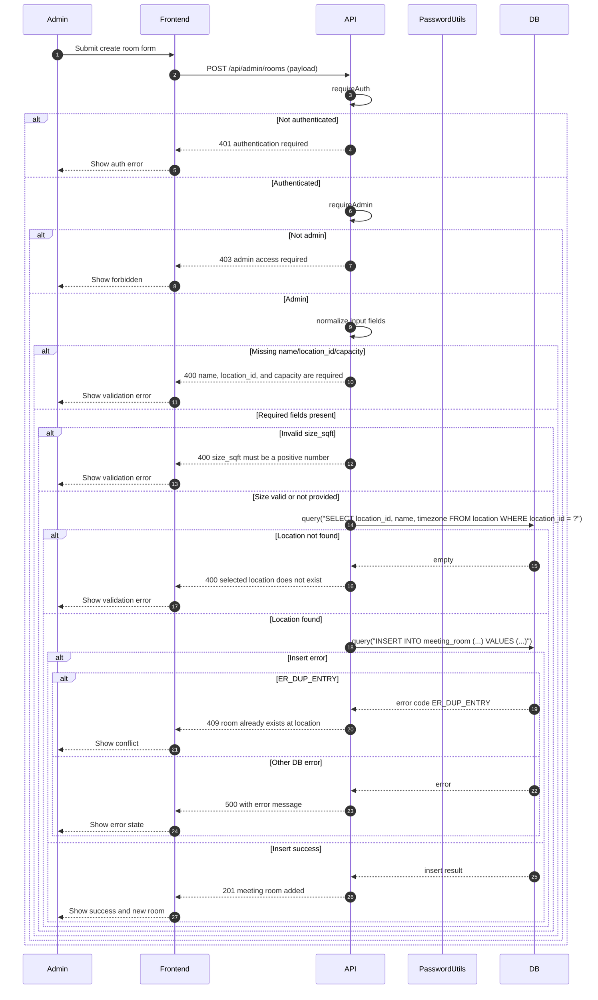

# Admin Panel Sequence Diagram: createRoom

```mermaid
sequenceDiagram
autonumber
participant Admin
participant Frontend
participant API
participant PasswordUtils
participant DB

Admin->>Frontend: Submit create room form
Frontend->>API: POST /api/admin/rooms (payload)
API->>API: requireAuth
alt Not authenticated
API-->>Frontend: 401 authentication required
Frontend-->>Admin: Show auth error
else Authenticated
API->>API: requireAdmin
alt Not admin
API-->>Frontend: 403 admin access required
Frontend-->>Admin: Show forbidden
else Admin
API->>API: normalize input fields
alt Missing name/location_id/capacity
API-->>Frontend: 400 name, location_id, and capacity are required
Frontend-->>Admin: Show validation error
else Required fields present
alt Invalid size_sqft
API-->>Frontend: 400 size_sqft must be a positive number
Frontend-->>Admin: Show validation error
else Size valid or not provided
API->>DB: query("SELECT location_id, name, timezone FROM location WHERE location_id = ?")
alt Location not found
DB-->>API: empty
API-->>Frontend: 400 selected location does not exist
Frontend-->>Admin: Show validation error
else Location found
API->>DB: query("INSERT INTO meeting_room (...) VALUES (...)")
alt Insert error
alt ER_DUP_ENTRY
DB-->>API: error code ER_DUP_ENTRY
API-->>Frontend: 409 room already exists at location
Frontend-->>Admin: Show conflict
else Other DB error
DB-->>API: error
API-->>Frontend: 500 with error message
Frontend-->>Admin: Show error state
end
else Insert success
DB-->>API: insert result
API-->>Frontend: 201 meeting room added
Frontend-->>Admin: Show success and new room
end
end
end
end
end
end
```
