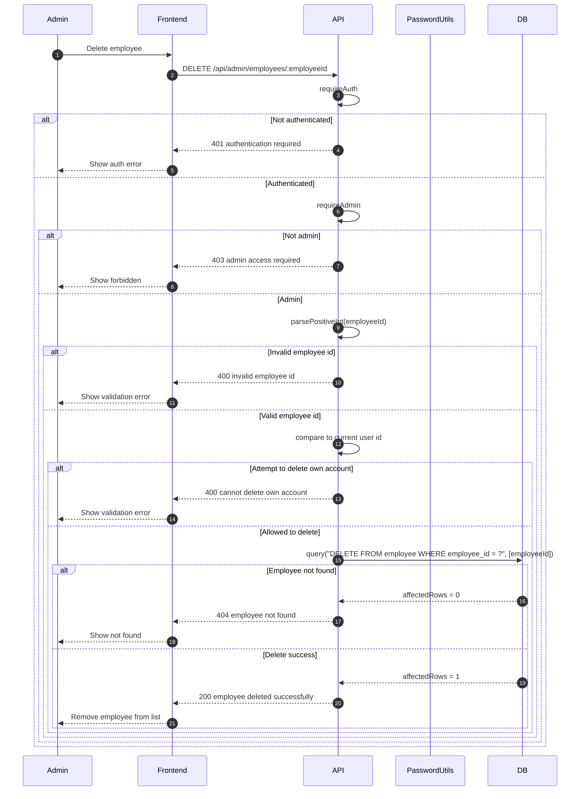

# Admin Panel Sequence Diagram: deleteEmployee

```mermaid
sequenceDiagram
autonumber
participant Admin
participant Frontend
participant API
participant PasswordUtils
participant DB

Admin->>Frontend: Delete employee
Frontend->>API: DELETE /api/admin/employees/:employeeId
API->>API: requireAuth
alt Not authenticated
API-->>Frontend: 401 authentication required
Frontend-->>Admin: Show auth error
else Authenticated
API->>API: requireAdmin
alt Not admin
API-->>Frontend: 403 admin access required
Frontend-->>Admin: Show forbidden
else Admin
API->>API: parsePositiveInt(employeeId)
alt Invalid employee id
API-->>Frontend: 400 invalid employee id
Frontend-->>Admin: Show validation error
else Valid employee id
API->>API: compare to current user id
alt Attempt to delete own account
API-->>Frontend: 400 cannot delete own account
Frontend-->>Admin: Show validation error
else Allowed to delete
API->>DB: query("DELETE FROM employee WHERE employee_id = ?", [employeeId])
alt Employee not found
DB-->>API: affectedRows = 0
API-->>Frontend: 404 employee not found
Frontend-->>Admin: Show not found
else Delete success
DB-->>API: affectedRows = 1
API-->>Frontend: 200 employee deleted successfully
Frontend-->>Admin: Remove employee from list
end
end
end
end
end
```
