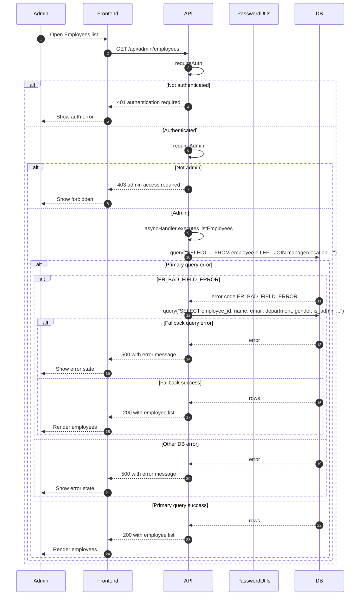

# Admin Panel Sequence Diagram: listEmployees

```mermaid
sequenceDiagram
autonumber
participant Admin
participant Frontend
participant API
participant PasswordUtils
participant DB

Admin->>Frontend: Open Employees list
Frontend->>API: GET /api/admin/employees
API->>API: requireAuth
alt Not authenticated
API-->>Frontend: 401 authentication required
Frontend-->>Admin: Show auth error
else Authenticated
API->>API: requireAdmin
alt Not admin
API-->>Frontend: 403 admin access required
Frontend-->>Admin: Show forbidden
else Admin
API->>API: asyncHandler executes listEmployees
API->>DB: query("SELECT ... FROM employee e LEFT JOIN manager/location ...")
alt Primary query error
alt ER_BAD_FIELD_ERROR
DB-->>API: error code ER_BAD_FIELD_ERROR
API->>DB: query("SELECT employee_id, name, email, department, gender, is_admin ...")
alt Fallback query error
DB-->>API: error
API-->>Frontend: 500 with error message
Frontend-->>Admin: Show error state
else Fallback success
DB-->>API: rows
API-->>Frontend: 200 with employee list
Frontend-->>Admin: Render employees
end
else Other DB error
DB-->>API: error
API-->>Frontend: 500 with error message
Frontend-->>Admin: Show error state
end
else Primary query success
DB-->>API: rows
API-->>Frontend: 200 with employee list
Frontend-->>Admin: Render employees
end
end
end
```
