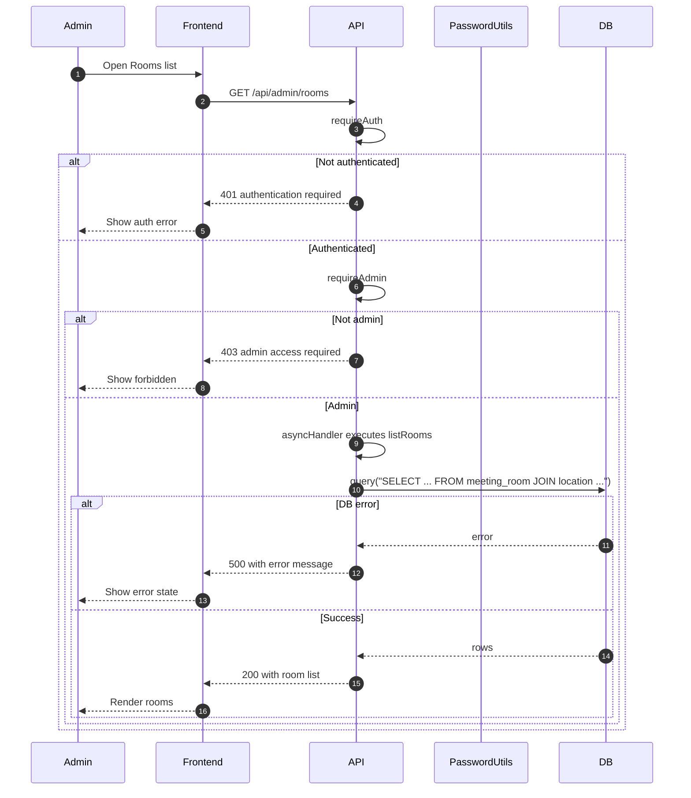

# Admin Panel Sequence Diagram: listRooms

```mermaid
sequenceDiagram
autonumber
participant Admin
participant Frontend
participant API
participant PasswordUtils
participant DB

Admin->>Frontend: Open Rooms list
Frontend->>API: GET /api/admin/rooms
API->>API: requireAuth
alt Not authenticated
API-->>Frontend: 401 authentication required
Frontend-->>Admin: Show auth error
else Authenticated
API->>API: requireAdmin
alt Not admin
API-->>Frontend: 403 admin access required
Frontend-->>Admin: Show forbidden
else Admin
API->>API: asyncHandler executes listRooms
API->>DB: query("SELECT ... FROM meeting_room JOIN location ...")
alt DB error
DB-->>API: error
API-->>Frontend: 500 with error message
Frontend-->>Admin: Show error state
else Success
DB-->>API: rows
API-->>Frontend: 200 with room list
Frontend-->>Admin: Render rooms
end
end
end
```
