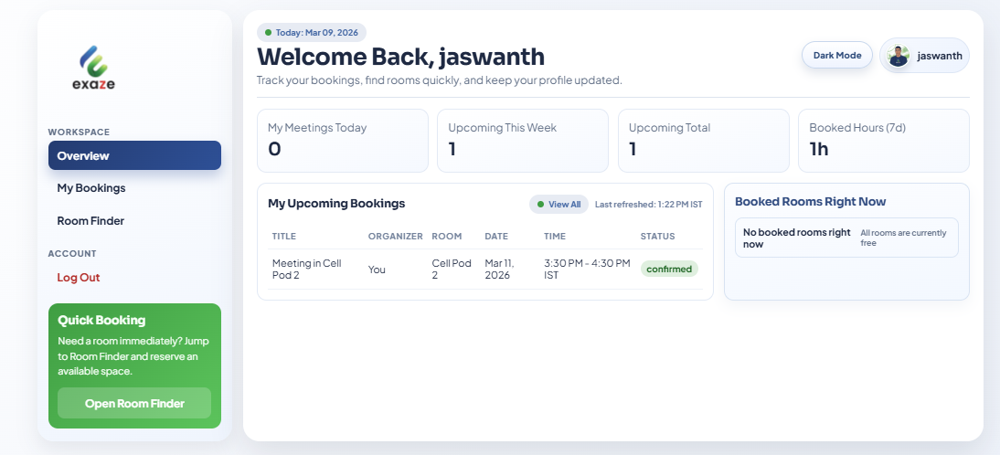
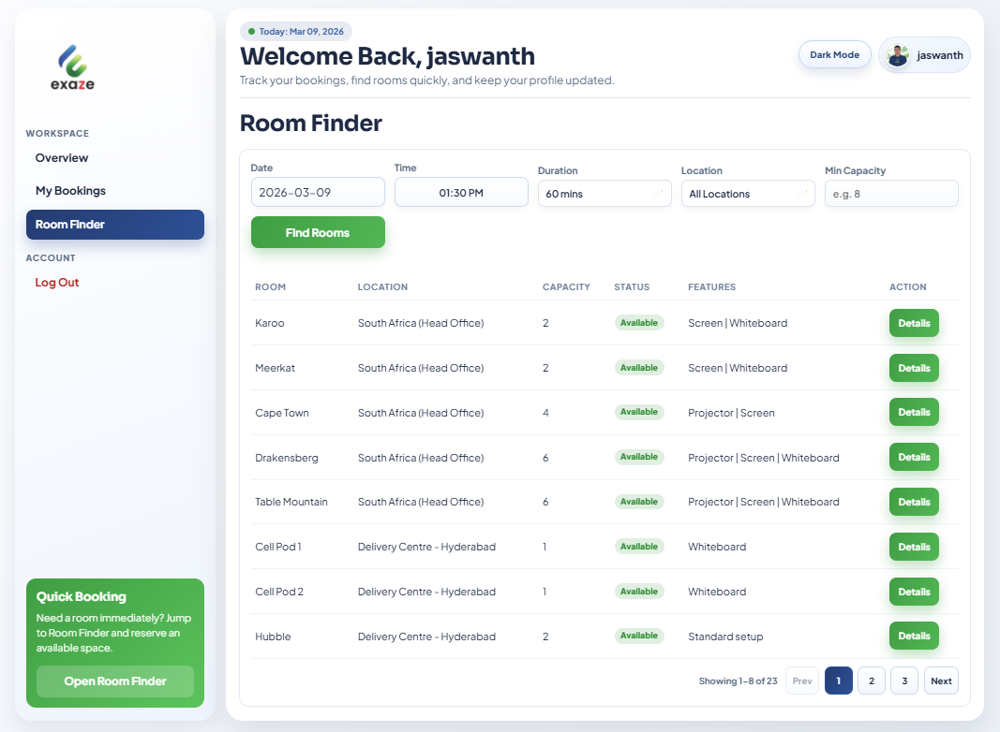
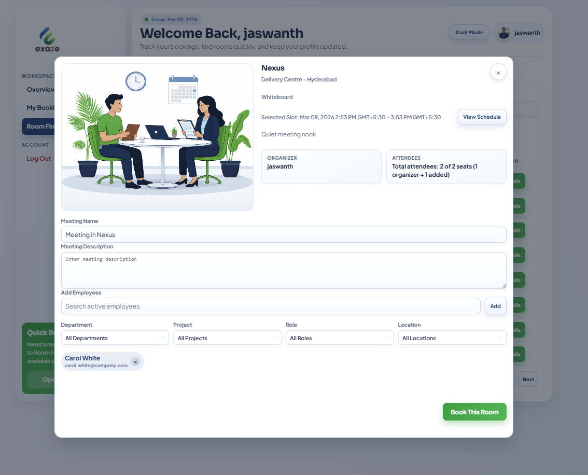
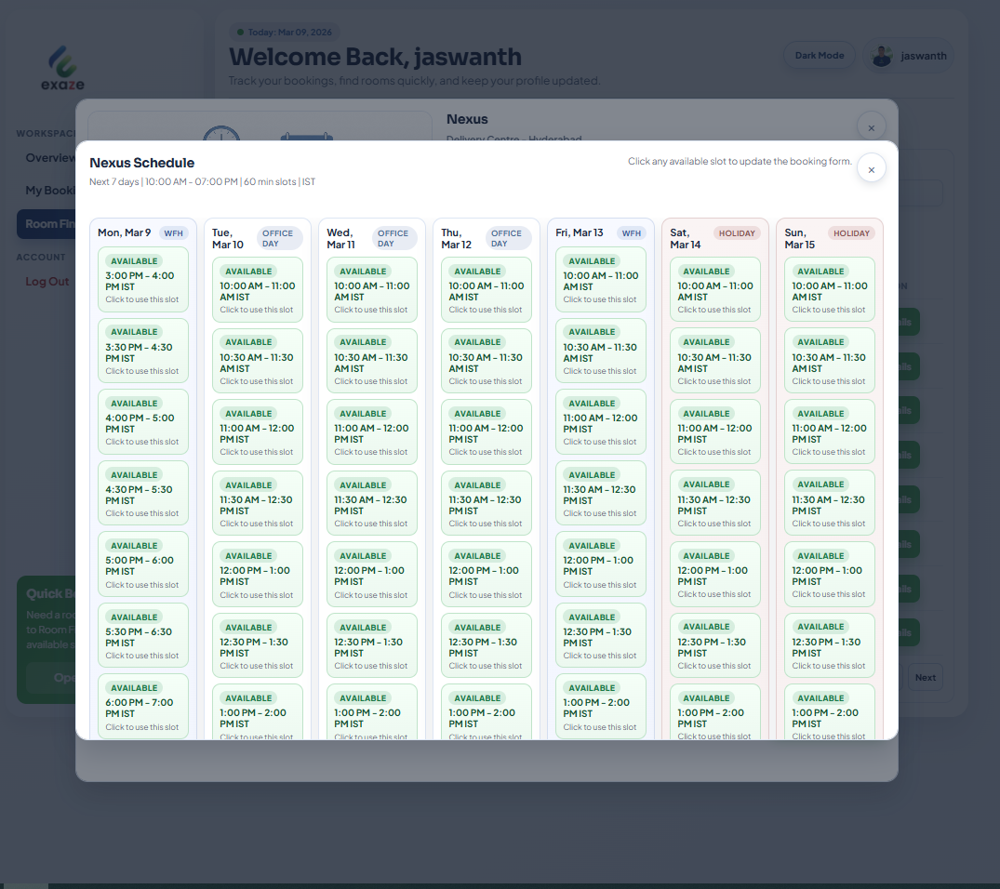
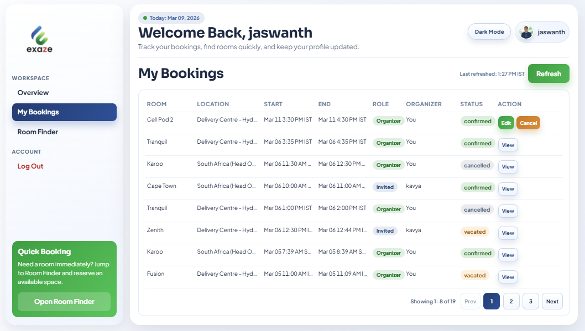
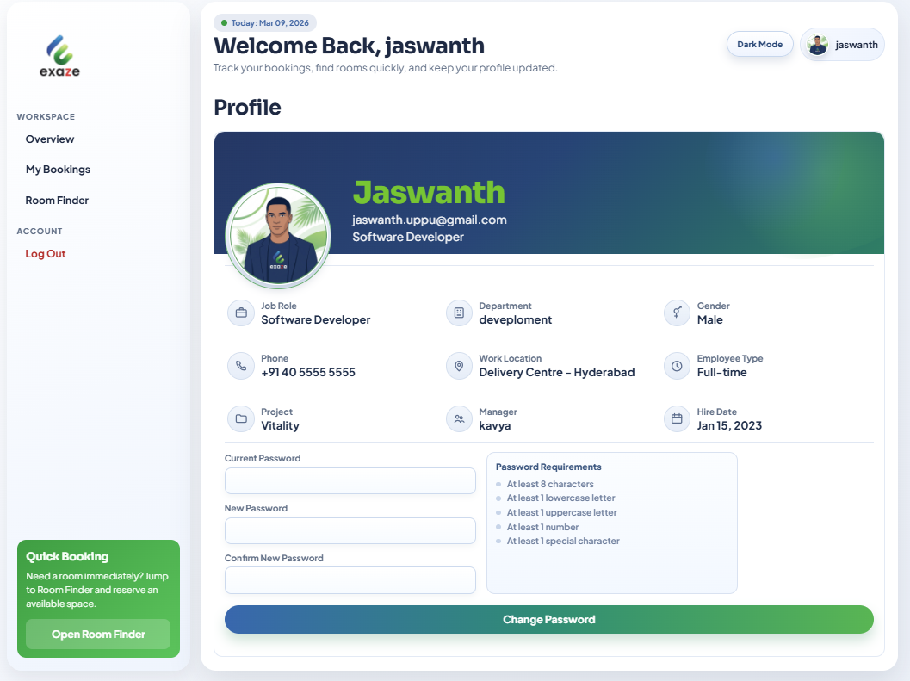
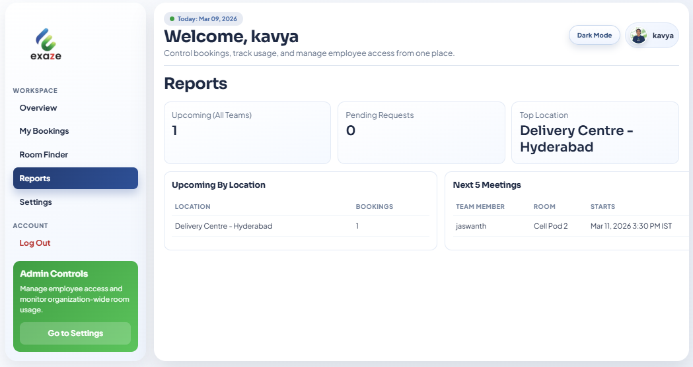
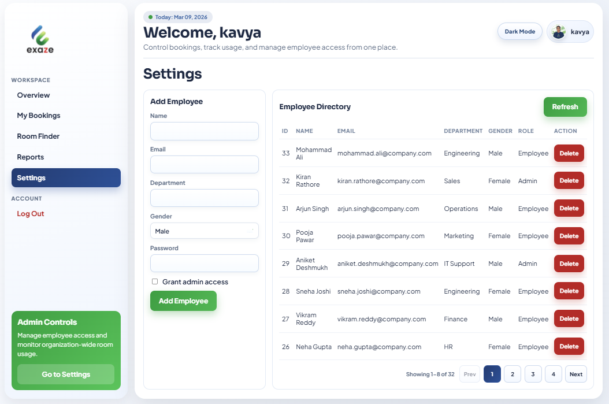

# Meeting Room Booking Application

## Brief Note on the Idea, Current Work, and Next Steps

I wanted to put together a simple note on the meeting room booking application idea, what I have built so far, and how I see it growing further. I am sharing this mainly to explain the thought process behind the idea and to show that the work is already moving beyond just a concept.

## Why I Thought of This

The basic idea came from a very practical problem. In office environments, meeting rooms are often available, but the process of finding the right room at the right time is not always smooth. People usually end up checking manually, asking others, or using disconnected methods to figure out availability.

That creates common issues:

- time gets wasted finding a room
- booking conflicts happen
- there is no single clear view of room availability
- admins do not have an easy way to understand how rooms are being used

Because of this, I felt there was value in building a proper internal application where employees can search, book, and manage meeting rooms in one place.

## What I Wanted This Application To Do

My intention was to create a centralized platform for meeting room booking across office locations.

From the employee side, the application should make it easy to:

- log in and access the system quickly
- check which rooms are available
- search by location, date, time, and capacity
- book a room without manual follow-up
- manage their bookings later if anything changes

From the admin side, it should make it easier to:

- manage employee access
- monitor booking activity
- view reports and booking patterns
- have better operational control as usage grows

So overall, the idea is not just to book rooms. It is to make room usage more visible, organized, and manageable.

## How I Made It More Practical

To avoid making this feel like a generic demo project, I also spoke with some people from our South Africa and Pune offices to understand room-related details.

Based on those discussions:

- I collected room capacity information for those locations
- I used that information while shaping the room data in the application
- in cases where there were no specific room names available, I assigned names so the rooms could still be represented clearly inside the system

This helped me make the application closer to a real office-use scenario instead of keeping it as just a sample booking tool.

## What I Have Implemented So Far

At this stage, I have already built a working foundation for the application.

### 1. Home Page and Entry Flow

The home page is designed to act as the first entry point into the application. It gives users a clear place to log in and also presents the product as a workspace booking platform.

What this currently supports:

- login entry for users
- branded landing experience
- room-focused presentation from the first screen

### 2. Employee Overview Dashboard

The employee overview is meant to give users a quick understanding of their booking activity once they enter the system.

What this helps with:

- users can immediately see booking-related information
- the system feels useful right after login
- employees get a better summary view instead of searching manually

### 3. Room Finder

This is one of the main parts of the application. The room finder is where the core idea becomes useful in practice.

What is implemented here:

- search by date
- search by time
- search by duration
- search by location
- search by room capacity
- room availability visibility before booking

This is important because it reduces the back-and-forth people usually go through when they are trying to find a suitable meeting room.

### 4. Booking Modal

I also built the booking modal so that users can review room details and proceed with booking from the same flow.

This helps because:

- room information is visible before booking
- the booking action feels more guided
- users are less likely to make rushed or incorrect bookings

### 5. Room Schedule View

The schedule view gives a more visual idea of availability across upcoming slots.

This adds value because:

- users can understand occupancy more easily
- alternate slots are easier to identify
- it reduces repeated failed booking attempts

### 6. My Bookings

I added a bookings section where users can see and manage their existing reservations.

This currently supports the booking lifecycle after creation:

- viewing booked meetings
- tracking booking status
- managing future reservations

One important part I have already implemented is participant-based booking visibility. If an employee is added to a booking, that booking becomes visible to them in their Overview and My Bookings sections as an invited meeting. This makes the booking useful not only for the organizer, but also for the employees included in it.

### 7. Employee Profile

I included a profile section so the application feels like a real internal system instead of a single-purpose page.

This currently supports:

- user profile visibility
- password management
- a more complete employee-facing experience

### 8. Admin Reports

From the admin side, I wanted the system to give some visibility into usage, not just booking actions.

This helps show:

- booking volume
- upcoming usage
- how the platform can later support reporting and analytics

### 9. Admin Settings and Employee Management

I also added admin-side employee management so the system can be controlled properly as an internal application.

This currently supports:

- employee management
- admin-level control
- a more realistic internal operations flow

## Current Functional Scope

From the implementation side, the application already includes:

- employee and admin login flow
- separate dashboards for employee and admin users
- room search and availability checks
- room booking creation
- booking edit flow
- booking cancellation
- vacate flow for ongoing bookings
- participant support
- room schedule support
- profile and password management
- admin employee management
- basic booking reports
- role-based access control
- secure backend with authentication and validation

The project also already supports multiple locations in the data model, and the current setup includes multiple offices and meeting rooms, so it is not limited to a single-location concept.

## Why I Believe This Is Useful

I see this as a useful internal product because it solves a real day-to-day problem in a practical way.

The value is mainly in these areas:

- less manual coordination
- better visibility of room availability
- fewer booking conflicts
- easier self-service for employees
- more control and visibility for admins
- good foundation for future reporting and automation

## What I Would Like To Add Next

Once the current foundation is stable, I think the next improvements should focus on making the product smarter and more helpful in real office use.

Some good next steps would be:

- recurring bookings
- email notifications and reminders
- better conflict messaging
- favorite rooms or quick re-book options
- waitlist for unavailable rooms
- alternate room suggestions
- no-show handling or auto-release
- stronger analytics and reporting
- calendar integration in future

At the moment, I am also looking into the next improvement of sending email notifications when an employee is included in a booking. I feel this will make the flow more complete, because invited employees should not only see the booking inside the application, but should also receive direct communication through email.

## Closing Note

This application started as an idea to solve a simple but recurring office problem. After working on it, I now see it as something that can become a useful internal platform rather than just a booking screen.

The main reason I am sharing this is to present both the idea and the work already completed. I wanted the system to be practical, relevant to actual office usage, and capable of growing further with more business value over time.
